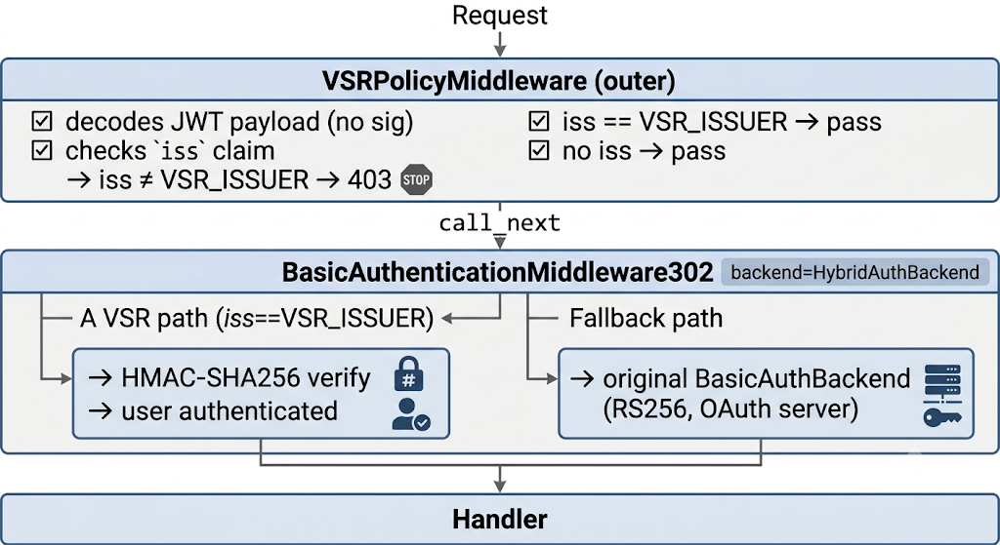
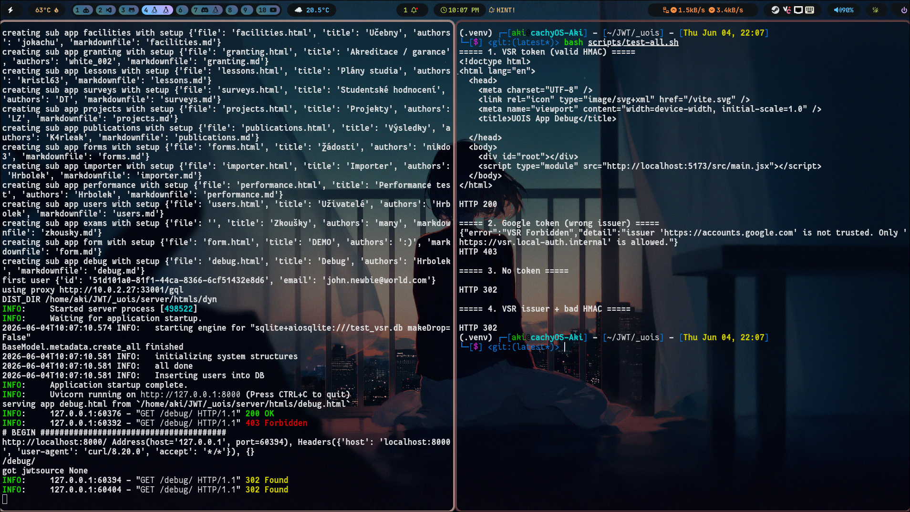
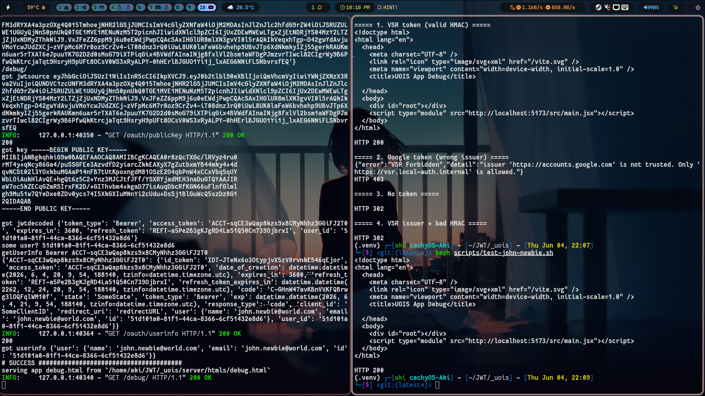

# **VSR Authentication Integration Report**

## **1. Problem**

While deploying UOIS in the VSR (Verified Secure Realm) infrastructure, we identified a critical security gap: the existing authentication middleware accepts any valid JWT regardless of its origin. An attacker (or foreign OAuth server) can issue a token for a Vietnamese citizen, and UOIS will process it — effectively delegating identity authority to external servers and forcing citizen credential data across borders.

## **2. Root Cause**

UOIS uses `BasicAuthBackend4Phase` which validates tokens via RS256 against a configurable OAuth public key endpoint (`JWTPUBLICKEY`). The validation is purely cryptographic — if the signature matches, the token is accepted. There is no check on the `iss` (issuer) claim. This works in a single-tenant deployment where the OAuth server is trusted, but in a multi-realm or cross-border context, a foreign server holding any user's email/password can mint a valid-looking RS256 token and access UOIS resources.

This is specifically a concern for Vietnam because:

- Citizen identity data is legally required to remain within national boundaries.
- Foreign-issued tokens that pass auth effectively export credential verification across borders.
- The existing auth stack has no policy layer to distinguish between a local and foreign issuer.

## **3. Solution**

We implemented a two-layer middleware stack that enforces issuer policy **without modifying any original UOIS auth code**. The original `BasicAuthBackend4Phase` remains untouched.

### **Architecture:**

## **4. Results**

### **Token Flows (DEMO=False):**

| Token Type | VSRPolicyMiddleware | HybridAuthBackend | Result |
|---|---|---|---|
| VSR HS256 (`iss=VSR_ISSUER`) | passes | HMAC verify → success | **200** |
| Google RS256 (`iss=accounts.google.com`) | **403** | — | **403** |
| No token | passes | fallback → redirect to /oauth/login2 | **302** |
| VSR + bad HMAC | passes | HMAC fail → AuthenticationError | **302** |
| OAuth RS256 (`iss=localhost`) | passes (no VSR_ISSUER) | fallback → RS256 verify → success | **200** |

### **Test Results:**

The output result is expected from the table above. The test scripts can be found in `scripts/test-*.sh` and can be run individually or all at once with `bash scripts/test-all.sh`.

Test to make sure VSR token with correct issuer and signature is accepted (DEMO=False):

Extra test to make sure the original OAuth flow is unaffected (DEMO=False):

## **5. Source Files**

### **Modified Files:**

| File | Change |
|---|---|
| `_uois/vsr/vsr_auth.py` | Created — core VSR logic, `VSRPolicyMiddleware`, `HybridAuthBackend` |
| `_uois/server/main-vsr.py` | Created - a copy of `_uois/server/main.py` with 5 sub-apps: replaced stacked auth with `HybridAuthBackend` + `VSRPolicyMiddleware` |
| `_uois/scripts/test-*.sh` | Created — test scripts for all 4 scenarios |
| `_uois/VSR_INTEGRATION.md` | Created — full technical documentation |

### **Source Code:**

All changes have been published to GitHub: [https://github.com/getbricked/_uois](https://github.com/getbricked/_uois)